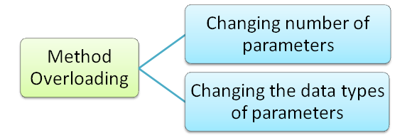

# Method Overload - ruby



El objetivo de este TP es la de insertar la funcionalidad de **Method Overload** al lenguaje Ruby. Con esto podremos definir para un mismo *symbolo* distintas implementaciones según el tipo y la cantidad de los parámetros que se pasen al invocar dicho método.

En esta entrega tenemos objetivo desarrollar la lógica necesaria para implementar la funcionalidad que se describe a continuación. Además de cumplir con los objetivos descritos, es necesario hacer el mejor uso posible de las herramientas vistas en clase, sin descuidar el diseño.
Esto incluye:
- Evitar repetir lógica.
- Evitar generar construcciones innecesarias (mantenerlo lo más simple posible).
- Buscar un diseño robusto que pueda adaptarse a nuevos requerimientos.
- Mantener las interfaces lo más limpias posibles.
- Elegir adecuadamente dónde poner la lógica y qué abstracciones modelar.
- Aprovechar las abstracciones provistas por el metamodelo de Ruby.
- Realizar testeos integrales de la aplicación cuidando también el diseño de los mismos.

## Antes de empezar: algunos consejos

El enunciado tiene **mucha** información, van a necesitar leerlo varias veces. La sugerencia es que lo lean entero una vez (para tener una idea general) y luego vuelvan a consultarlo las veces que hagan falta.

Concéntrense en los **requerimientos** y, excepto que se traben mucho, respeten el orden sugerido. Sería interesante que vayan creando las distintas clases y métodos a medida que resuelven cada requerimiento y no antes.

## Etapa 1

En esta primera etapa debemos definir la abstracción que representará cada una de las implementaciones de nuestro método *overloadeado*.

Para esto contamos con la clase **Implementacion** que posee un array de clases y un bloque. El array indica el tipo de los parámetros que se consideran válidos para poder correr el bloque.

Al momento de su creación, se debe corroborar que la cantidad de elementos del array de clases sea igual a la cantidad de parámetros que recibe el bloque.

Además, una **Implementacion** debe poder responder a los siguientes métodos:

1. **cumple**: Que recibe una cantidad variable de parámetros y devuelve **true** solamente si los parámetros se consideran válidos según el array de clases.
2. **ejecutar**: Que recibe una cantidad variable de parámetros y ejecuta el bloque con los parámetros recibidos.
3. **distancia_total**: Que recibe una cantidad variable de parámetros y devuelve un número entero, que representa la distancia entre las clases de los parámetros y la clase del array de clases. Cada distancia individual debe ser multiplicada por su posición. A continuación hay un ejemplo:
```ruby=
# Si el array de clases es [Numeric, String, Object] y los parámetros [1.0, "Hola", "Mundo!"]
# distancia_entre_1.0_y_Numeric = 1 ; posicion = 1 (1er elemento del array)
# distancia_entre_"Hola"_y_String = 0 ; posicion = 2
# distancia_entre_"Mundo!"_y_Object = 2 ; posicion = 3
distancia_total = 1 * 1 + 0 * 2 + 2 * 3 = 7
```

## Etapa 2

En esta etapa vamos a continuar con la creación de **ImplementacionDispatcher**. Los *dispatchers* van a ser los encargados de guardar las distintas **Implementaciones** para un **symbolo** determinado.

Los *dispatchers*, al recibir el mensaje **ejecutar** con una cantidad variable de parámetros, deben determinar qué **Implementacion** es la que se debe ejecutar. Dicha **Implementacion** es la que **cumple** y tenga menor **distancia_total**.

Para esta etapa, se pide que se puedan agregar nuevas implementaciones a un **ImplementacionDispatcher** y que se defina el método **ejecutar**.

## Etapa 3

En esta etapa queremos otorgarle a los ***modules*** y a las ***classes*** la capacidad de definir métodos *overloadeados*. Para esto se debe definir el método **overloadeado**, que recibe el *sym* del método, el array de clases y el bloque de código de la **Implementacion** que se quiere definir. Vale aclarar que luego de generar la(s) **Implementacion(es)** de un método, debo poder invocar dicho método con los diferentes tipos y/o cantidad de parámetros. Se deja un ejemplo del uso esperado:
```ruby=
class StringUtil
    overloadeado :longitud, [String] do |s|
        s.length
    end
    
    overloadeado :longitud, [String, String] do |s1, s2|
        s1.length + s2.length
    end
end

string_util = StringUtil.new
string_util.longitud("Hola") # 4
string_util.longitud("Hola", "Mundo!") # 10
```

## BONUS: Etapa 4

Para seguir contando con la introspección que nos brinda Ruby, queremos mantener la coherencia en el método **respond_to?**. Para ello vamos a redefinirlo con las siguientes especificaciones:

* El método se define con los 2 parámetros del original **(sym, include_all=false)**, y se agrega un tercero, que es un array de clases para chequear si es igual que el de alguna **Implementacion** para dicho **sym**.
* Si el array de clases no se pasa, la funcionalidad debe mantenerse como la original.
* Si se pasa el array de clases, solamente se devuelve **true** si existe una **Implementacion** para dicho **sym** cuyos tipos de parámetros sean **exactamente** las clases del array del parámetro.